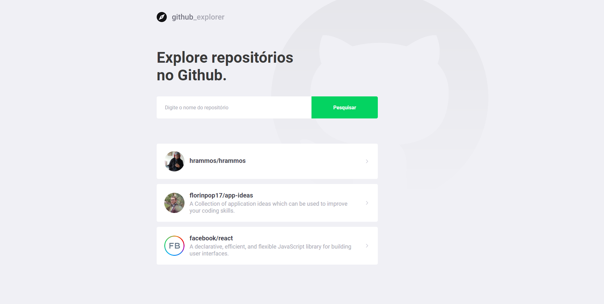
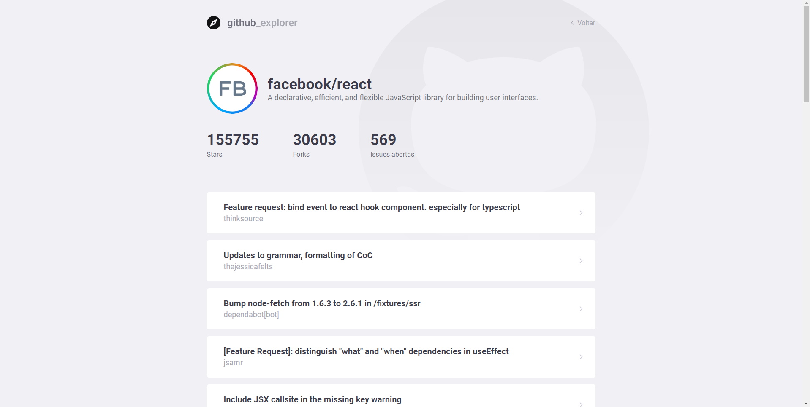

<h1 align="center">Github explorer</h1>
<h3 align="center">⚡ Simple React project to explore repos in the Github. ⚡</h3>
<br />

## Screenshots
<p align="center">
  
  
</p>


## About
<p align="left">
  A simple React project to explore repositories in the Github.
</p>
<p align="left">
  One of my first React projects using Typescript. And it was probably in this project that I started to like Typescript, it was developed together with Rocketseat Bootcamp.
</p>

<br />

## How to run 🔥

```bash
# Clone this repository
$ git clone https://github.com/hrammos/github-explorer.git

# Go into the repository
$ cd github-explorer

# Install dependencies
$ yarn install

# Run web application
$ yarn start
```

<br />

-------
#### By [Henrique Ramos](https://www.linkedin.com/in/henriqueoramos) 👋
